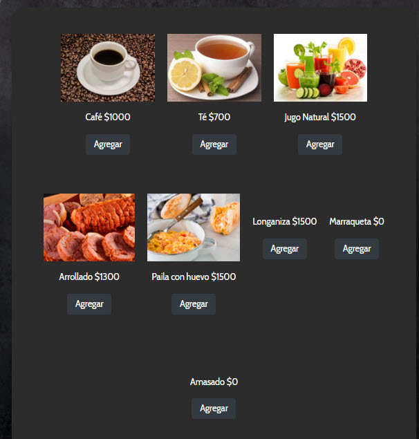
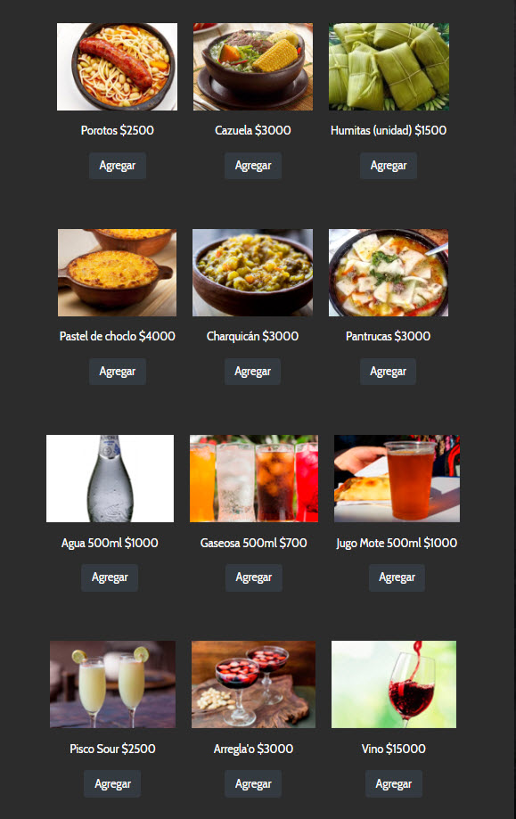
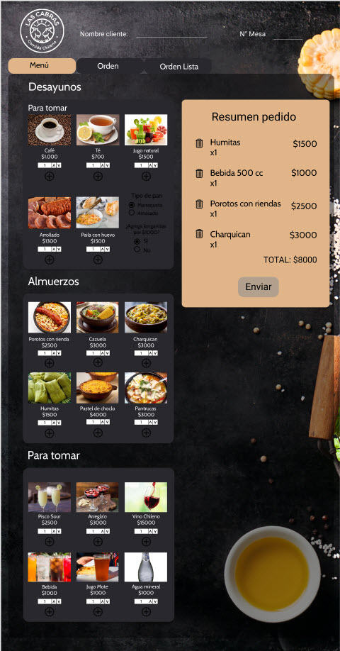
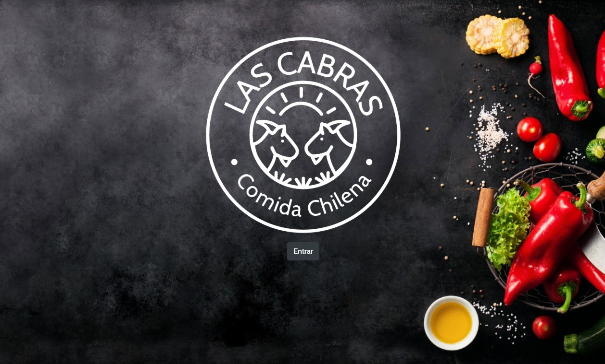
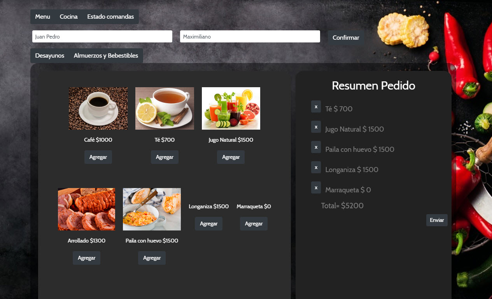
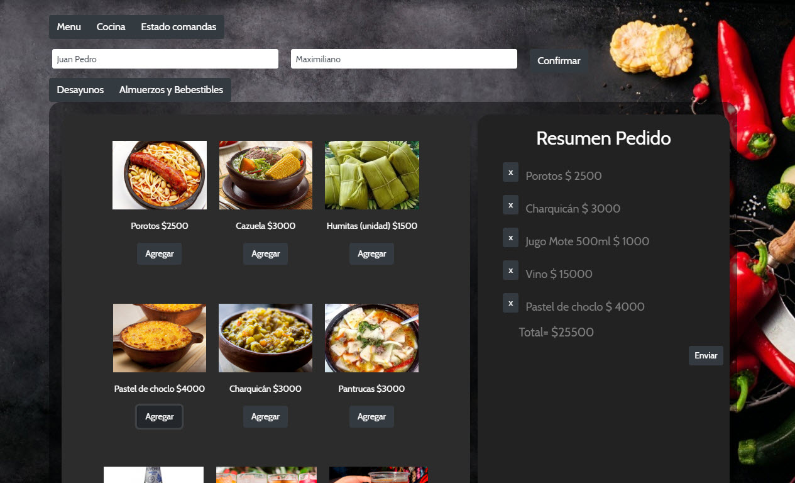
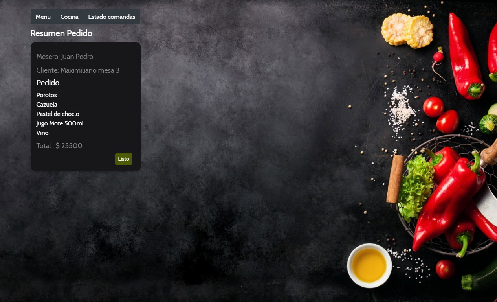

 

# Las Cabras, comida chilena

## Introducción.

* [1. Introducción ](#1-Introduccion)
* [2. Resumen del proyecto](#2-resumen-del-proyecto)
* [3. Uso de la plataforma](#3-uso-de-la-plataforma)
* [4. Diseño de alta fidelidad](#4-diseño-de-alta-fidelidad)

***

## 1. Introducción

Burger Queen es una interfaz que permite a un local de comida, en nuesto caso "Las Cabras, comida chilena" anotar las ordenes de los clientes. Ya no más lapiz, papel y letra ilegible en las comandas. Con esta aplicación podrás obtener de manera rápida los pedidos de los clientes, mediante el mesero, quien utilizará la aplicación a través de una tablet, ya que es una plataforma responsiva, diseñada para la comodidad de una tableta.

## 2. Resumen del proyecto

Somos "Las Cabras" un restaurante de comida típica chilena, con platos muy caseros y sabrosos, al gusto del cliente.
nuestra especialidad es dejar al cliente satisfecho, contento y con ganas de volver a probar nuestra rica comida, con
ingredientes finamente seleccionados para entregar la mejor calidad de productos al consumidor.

En primer lugar, nuestro proyecto va enfocado al uso que da el mesero para hacer el servicio más rápido en la toma de los pedidos, y a su vez que no existan complicaciones de orden a la hora de la preparación, evitando comandas perdidas y letra poco legible para nuestros chefs.

El menu consta de dos categorias principales, una de ellas es Desayuno, en donde el cliente se podrá deleitar con una rica paila de huevos, obviamente de campo, en un delicioso pan amasado o marraqueta, recien salida del hono de barro.
Ademas en la carta ofrecemos un delicioso arrollado de huaso para empezar la mañana con mucha energía.
Incluimos promociones, en la cual puede agregar longanizas por $1500 pesos.

La segunda categoría es Almuerzos, en donde tenemos la mejor selección de platos chilenos, tales como porotos con rienda y longaniza, charquican, pantrucas, el infaltable pastel de choclo y las deliciosas humitas, entre otros. Dentro de este menú se podrá seleccionar los bebestibles, que incluye agua mineral, gaseosas y por supuesto un gran vino Chileno, tipico de nuestra tierra.

A continuacion se puede ver el detalle de ambos menu:

Nuestros clientes podrán cambiar de parecer al elegir un plato, por lo que se podrá editar la comanda cuantas veces lo requiera antes de finalizarla.

La interfaz debe mostrar los dos menús (desayuno y Almuerzo), cada uno
con todos sus _productos_. El usuario debe poder ir eligiendo qué _productos_
agregar y la interfaz debe ir mostrando el _resumen del pedido_ con el
costo total.

## 3. Uso de la plataforma

El uso de la aplicacion es bastante sencillo y no requiere de un conocimiento avanzado para poder usarla. Es intuitiva y facil dde usar. Primero que todo tenemos la pagina inicial con el logotipo del restaurant, en esa vista hay un boton "Entrar" que nos redirige inmediatamente a la selección del tipo de Menu.

Posterior a la seleccion del menu, ya sea, Desayunos o Almuerzos, el mesero debe ingresar su nombre en el área indicada, esto hará que las comandas estén identificadas con su nombre ante cualquier eventualidad. También se debe ingresar el nombre del cliente y su mesa para identificar donde se va a entregar el pedido.

Una vez ingresado ambos nombres, se hace la selección de productos que el cliente desea comer y se presiona el boton "Enviar" en donde se mandará la comanda a la cocina junto con el precio para realizar la boleta posterior.

Luego de ser ingresada la orden el cocinero deberá indicar solo cuando esté lista para que el mesero la entregue al cliente, así la interaccion es mucho más rapida para el chef, ya que no puede estar pendiente de presionar tantos botones en la tablet, y solo lo hará cuando finalice la orden.

## 4. Diseño de alta fidelidad

Para nuestro diseño de alta fidelidad usamos la aplicación Figma, la cual nos ayudó mucho a la visualización de nuestra aplicacion y concretando las ideas que teníamos sobre el diseño de la plataforma. Se trató de respetar la linea del prototipo, pero siempre mejorando el diseño según el feedback de personas entendidas en la materia. 

A continuacion visualizaremos el diseño inicial de la aplicación.

Menu principal: La paleta de colores era en un inicio negro con naranjo/damasco, sin embargo al llevar a cabo el proyecto nos dimos cuenta que las imagenes de los alimentos ya contenian demasiada informacion visual, por lo que se sugirió un cambio de colores, dejando algo mas neutro y menos cargado. 
Después de probar varios estilos de fondo, nos quedamos con el negro pizarra, que combina muy bien con la temática escogida y con ingredientes naturales, tales como los de nuestros platos chilenos.

Cocina: Para la seccion del Cocinero se cambio el nombre de la pestaña Orden a Cocina, para que sea más entendible, en esta sección tambien los colores variaron respecto al diseño original pero manteniendo la facilidad de manejo al usuario, en este caso, el Jefe de cocina. Las ordenes se agrupan por orden de llegada y con la comanda muy bien especificada.

Estado de la comanda: Para finalizar el diseño de alta fidelidad incluimos un apartado para estado de la comanda, inicialmente llamado Orden Lista, se cambio el nombre para entregar congruencia al lenguaje gastronómico. En esta sección se puede ver la hora de salida del plato para que sea entregado a los comensales y una vez finalizado este proceso se puede marcar con el boton "Entregado". La paleta de colores también varió y se opto por colores mas sobrios.

# Historias de usuario

#### [Historia de usuario 1] Mesero/a debe poder tomar pedido de cliente

Yo como meserx quiero tomar el pedido de un cliente para no depender de mi mala
memoria, para saber cuánto cobrar, y enviarlo a la cocina para evitar errores y
que se puedan ir preparando en orden.

##### Criterios de aceptación

Lo que debe ocurrir para que se satisfagan las necesidades del usuario

* Anotar nombre de cliente.
* Agregar productos al pedido.
* Eliminar productos.
* Ver resumen y el total de la compra.
* Enviar pedido a cocina (guardar en alguna base de datos).
* Se ve y funciona bien en una _tablet_

#### [Historia de usuario 2] Jefe de cocina debe ver los pedidos

Yo como jefx de cocina quiero ver los pedidos de los clientes en orden y
marcar cuáles están listos para saber qué se debe cocinar y avisar a lxs meserxs
que un pedido está listo para servirlo a un cliente.

##### Criterios de aceptación

* Ver los pedidos ordenados según se van haciendo.
* Marcar los pedidos que se han preparado y están listos para servirse.
* Ver el tiempo que tomó prepara el pedido desde que llegó hasta que se
  marcó como completado.

#### [Historia de usuario 3] Meserx debe ver pedidos listos para servir

Yo como meserx quiero ver los pedidos que están preparados para entregarlos
rápidamente a los clientes que las hicieron.

##### Criterios de aceptación

* Ver listado de pedido listos para servir.
* Marcar pedidos que han sido entregados.

# Proyecto finalizado

Para concretar el proyecto se hizo algunos cambios en la paleta de colores, prefiriendo un diseño mas sobrio y con la menor cantidad de botones posible para que la interacción sea mas rápida y fluida a la hora de tomar la orden, a continuación se muestra las distintas vistas de la aplicación

# Libreria utilizada

[React](https://es.reactjs.org/) es una _librería_ de JavaScript más utilizados por
lxs desarrolladorxs alrededor del mundo, y hay una razón para eso.
En el contexto del navegador, [_mantener la interfaz sincronizada con el estado
es difícil_](https://medium.com/dailyjs/the-deepest-reason-why-modern-javascript-frameworks-exist-933b86ebc445).
Al elegir una _librería_ para nuestra interfaz, nos apoyamos en una
serie de convenciones e implementaciones _probadas_ y _documentadas_ para
resolver un problema común a toda interfaz web. Esto nos permite concentrarnos
mejor (dedicar más tiempo) en las caractrísticas _específicas_ de
nuestra aplicación.

Cuando elegimos una de estas tecnologías no solo importamos un pedacito de
código para reusarlo (lo cuál es un gran valor per se), si no que adoptamos una
**arquitectura**, una serie de **principios de diseño**, un **paradigma**, unas
**abstracciones**, un **vocabulario**, una **comunidad**, etc...

Como desarrolladora Front-end, estos kits de desarrollo pueden resultarte
de gran ayuda para implementar rápidamente características de los proyectos en
los que trabajes.

# Autoras

* [Fernanda Montecinos](https://https://github.com/montecinosc)
* [Lilibeth Gaete](https://https://github.com/Lilibeth-Gaete)
* [Bárbara Madariaga](https://https://github.com/BarbaraMV)

Gracias por su atención.

